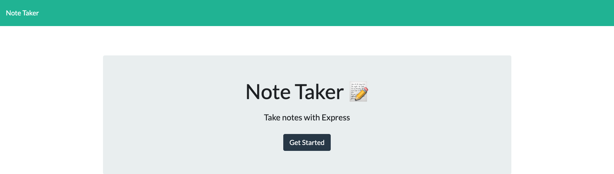
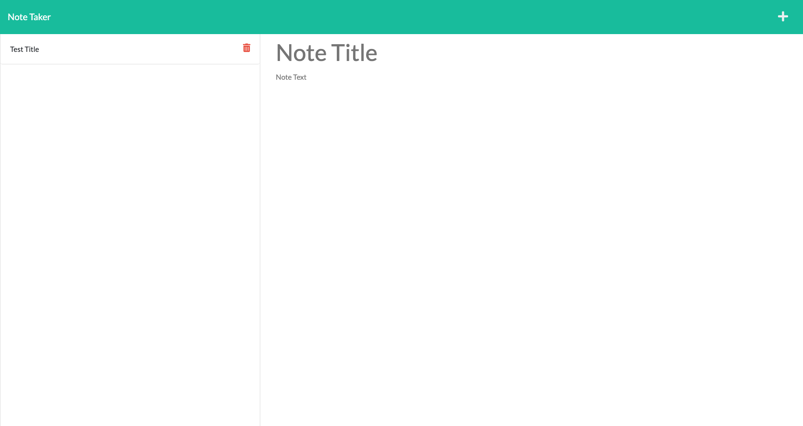
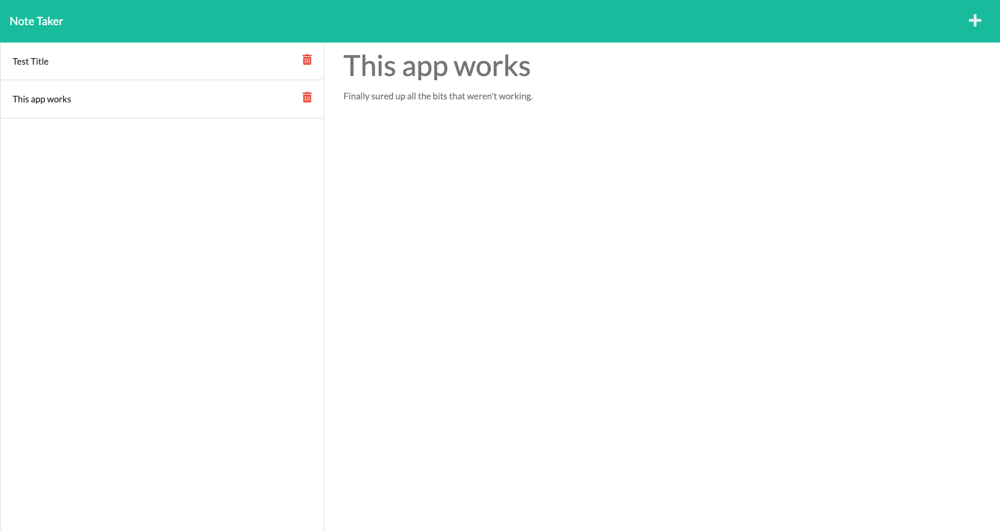

# Note Taker Project

## Table of Contents 
* [Description](#description)
* [Usage](#usage)
* [Visuals](#visuals)

## Description

[Link to live app.](https://lit-dusk-65748.herokuapp.com/)

The Note Taker is an app that is deployed on Heroku and uses Express.js as its primary backend tool. Upon opening the app, you are presented with a landing page for the app. When you click on the link to continue to the notes page, if there are any notes saved in the database of notes beforehand, your saved notes will be displayed on the left hand side. 

From there you can click on a note to bring it into the main, right side section. If you press the '+' symbol in the nav bar, the field will clear and you will be able to enter new material in the input fields. Once both sections of the note are populated with text, a save icon will appear in the nav bar which will enable you to save the note to a database as well as view it on the left side column with your other notes. The delete button also works to remove notes that you no longer need.

## Usage

If you'll be running the app through the command line and not through Heroku, upon cloning the repository, you will need to run some commands:

* to download dependencies and make sure they are up to date:

    ```
    npm i
    ```

* to run the app itself:

    ```
    node server.js
    ```


## Visuals

Here is a mockup of the appliocation's appearance and functionality:



